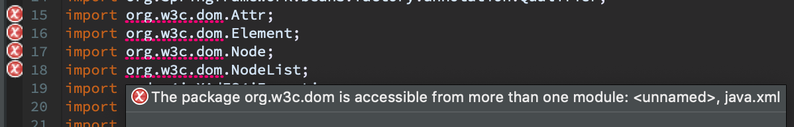
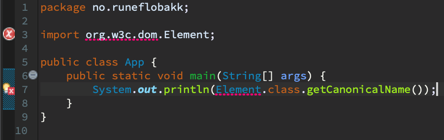
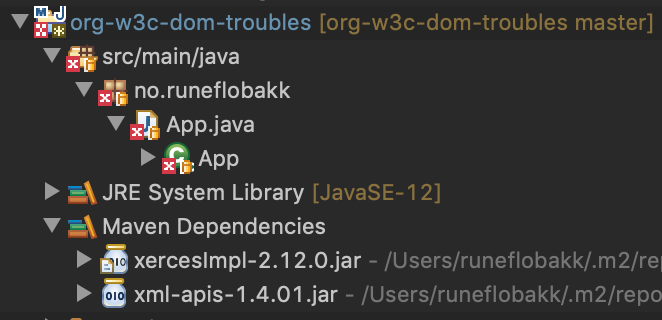
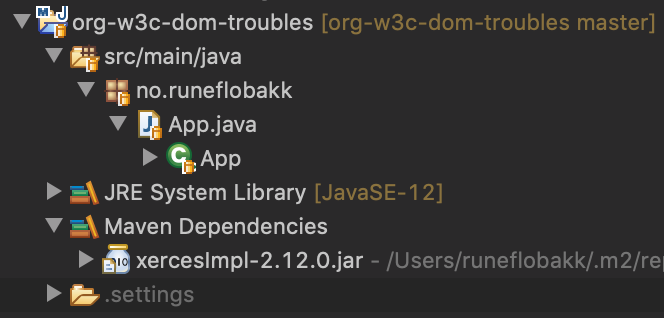

# Error in Eclipse Java editor

This project isolates a certain aspect of this issue:
[bugs.eclipse.org/bugs/show_bug.cgi?id=536928](https://bugs.eclipse.org/bugs/show_bug.cgi?id=536928)

Eclipse refuses to compile source code which references `w3c.org.dom.*` with `xml-apis` present on classpath:

This compiles fine with javac. Excluding `xml-apis` from classpath will make the source compile also with the Eclipse compiler. But it seems like the error is still present _in the editor view_ even after excluding `xml-apis` as a transitive dependency of e.g. `xercesImpl`, but the "red markers" disappears from the Project Explorer view. Eclipse manages to compile the source code, even though the editor shows errors.

## With xml-apis on classpath

 

## Without xml-apis on classpath

 
